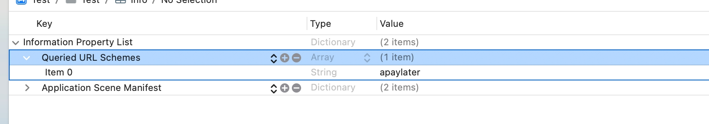

# Atome paylater Flutter SDK

## Getting Started

```sh
atome_sdk_flutter: ^0.0.2
```

## Usage

For iOS, add the following to your Info.plist file:
add "Queried URL Schemes" to your info.plist, type is "Array",add a string value "apaylater"

eg.


### Initialize plugin
```dart
final _atomeSdkFlutterPlugin = AtomeSdkFlutter();
```

### Check atome is installed
```dart
final isAtomeInstalled = await _atomeSdkFlutterPlugin.isAtomeInstalled();
```

### Open an atome link to open atome app
```dart
final result = await _atomeSdkFlutterPlugin.openAtomeLink("xxxPaymentUrl");
```

## License

MIT